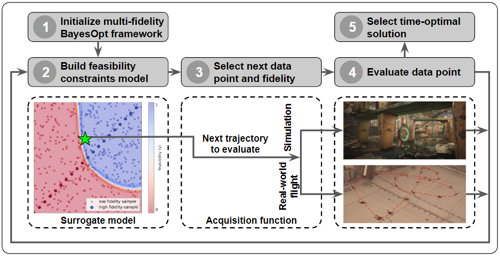

# mfboTrajectory
This is the code for the paper, "Multi-Fidelity Black-Box Optimization for Time-Optimal Quadrotor Maneuvers". [[Paper]](https://arxiv.org/abs/2006.02513)

[](https://www.youtube.com/watch?v=igwULi_H1Kg)

This code uses the PID controller instead of [INDI controller](https://arxiv.org/abs/1809.04048) which is used in the original paper.
This repository is composed of three main packages; *pyTrajectoryUtils*, *pyMulticopterSim*, and *mfboTrajectory*.
*pyTrajectoryUtils* includes the code for minimum-snap trajectory generation and PID controller. *pyMulticopterSim* provides the python wrapper for the [multicopterDynamicsSIm](https://github.com/mit-fast/multicopterDynamicsSim), which is used in the simulator [FlightGoggles](https://github.com/mit-fast/FlightGoggles). *mfboTrajectory* includes the core algorithm of the proposed papers, such as multi-fidelity bayesian optimization frameworks and evaluations of different fidelities. To apply this framework on the different dynamics system, you should update the low-fidelity evaluations and high-fidelity evaluations in *multiFidelityModelWaypoints.py* or *multiFidelityModelPolytopes.py*.


## Installation with docker
```bash
git clone github.com:MIT-AERA/mfboTrajectory.git
git submodule update --init --recursive
docker build -t mfbo_traj .
./run_docker.sh
source setup_venv/setup.bash
python setup.py install
```


## Trajectory optimization with waypoints constraints
```bash
# Optimization in simulated environment.
python run_mfbo_waypoints.py
# Initialization for the hybrid environment (Find the initial time allocation for the real-world flights)
python run_mfbo_waypoints_robot_tune.py -a 1.2
# Optimization in simulated environment.
python run_mfbo_waypoints_robot.py
```


## Trajectory optimization with polytopes constraints
For the polytopes constriants, it requires the optimizer for the quadratic programming. In this code, we set the OSQP as the default optimizer, but Gurobi is used for the published paper.
```bash
# Optimization in simulated environment.
python run_mfbo_polytopes.py -t 0 -s 0
# Initialization for the hybrid environment (Find the initial time allocation for the real-world flights)
python run_mfbo_polytopes_robot_tune.py -a 1.2
# Optimization in simulated environment.
python run_mfbo_polytopes_robot.py
```


## Citation
If you find this work useful for your research, please cite:
```bibtex
@inproceedings{ryou_tal_ijrr,
  title={Multi-Fidelity Black-Box Optimization for Time-Optimal Quadrotor Maneuvers},
  url = {https://doi.org/10.1177/02783649211033317},
  author={Ryou, Gilhyun and Tal, Ezra and Karaman, Sertac},
  booktitle={The International Journal of Robotics Research (IJRR)}
}
```
